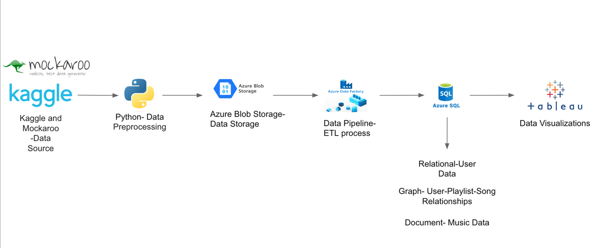
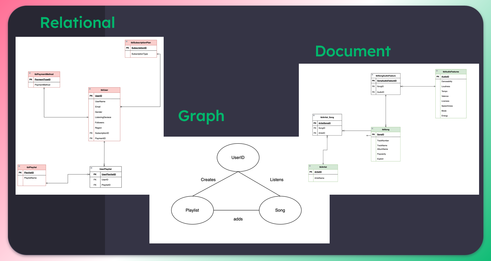
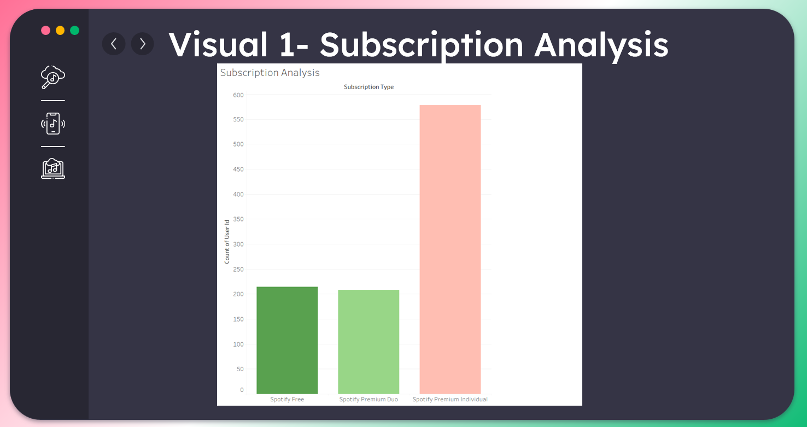
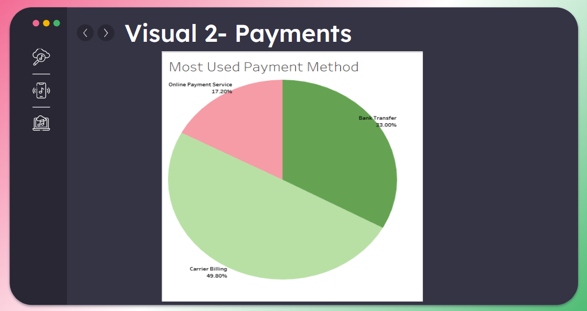
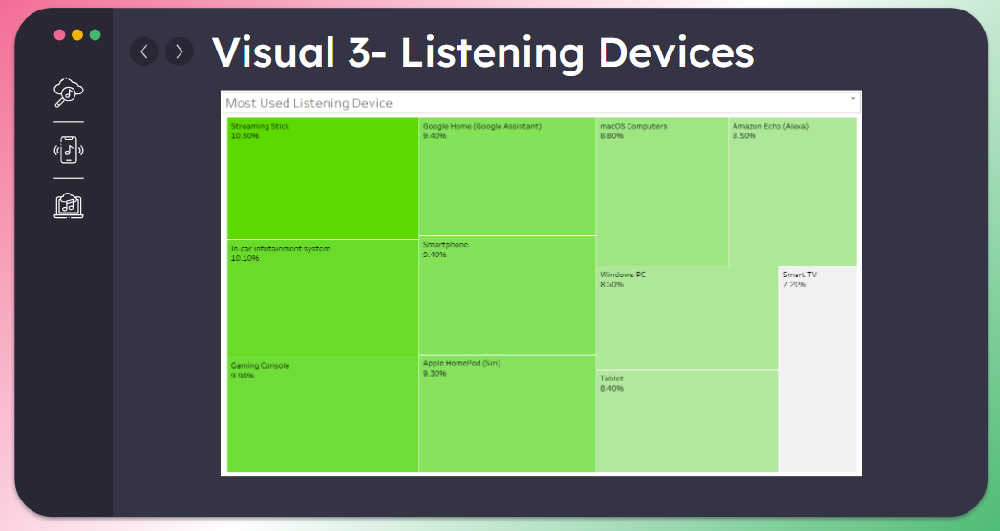
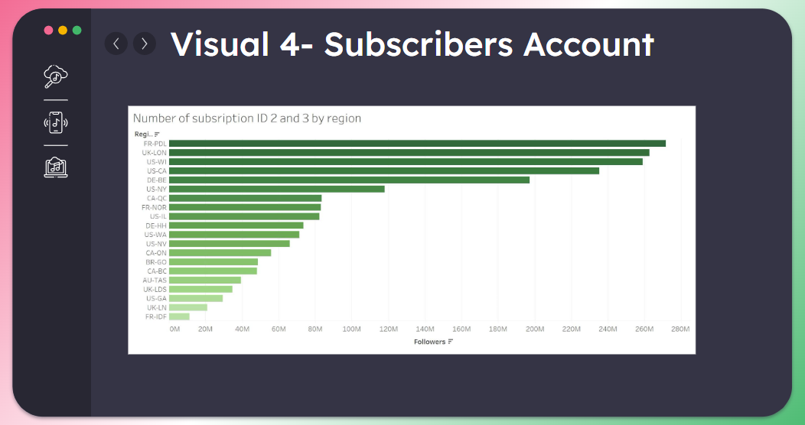

# Spotify Management System using Azure Cloud Database and Services

## Overview
This project implements a Spotify Management System leveraging Azure Cloud's database and data processing services. The architecture integrates data from Kaggle and Mockaroo, processes it using Python, stores it in Azure Blob Storage, and further manages it using Azure Data Factory and Azure SQL Database. The final data visualizations are created using Tableau.

## Architecture

## Implementation Steps
### Step 1: Dataset Identification
- **Data Source:** Kaggle dataset containing information on artists, songs, and their audio features.
- **Additional Data:** Generated dummy data using Mockaroo to supplement the existing dataset.

### Step 2: Data Preprocessing with Python
- **Preprocessing Tasks:** 
  - Removed null values.
  - Eliminated duplicates.
  - Ensured data consistency and quality.
  - 
 

### Step 3: Azure Environment Setup
- **Resource Group:** Created a resource group in Azure to manage all related services.
- **Azure Blob Storage Account:** Set up an Azure Blob Storage account and created a container to store CSV files securely.

### Step 4: Database and Data Pipeline Configuration
- **Azure SQL Database:** Set up a database server and linked it to Azure Blob Storage.
- **Azure Data Factory:**
  - Created a data factory to automate the ETL (Extract, Transform, Load) process.
  - Established data pipelines to efficiently transfer data from Blob Storage to the Azure SQL Database.

### Step 5: Advanced Data Handling with Azure Data Studio
- **Document Database:** Inserted processed data into a document database for unstructured data handling.
- **Graph Database:** Managed user-playlist-song relationships using a graph database to enable advanced relational queries.

### Step 6: Data Visualization with Tableau
- **Data Visualization:** Connected Tableau to the Azure SQL Database to create interactive dashboards and visualizations for insights into user data, song relationships, and document-based music data.

## Key Components

- **Data Sources:** Kaggle, Mockaroo
- **Preprocessing:** Python
- **Data Storage:** Azure Blob Storage
- **ETL Process:** Azure Data Factory
- **Databases:**
  - Relational Database (Azure SQL)
  - Graph Database (User-Playlist-Song Relationships)
  - Document Database (Music Data)
- **Data Visualization:** Tableau
